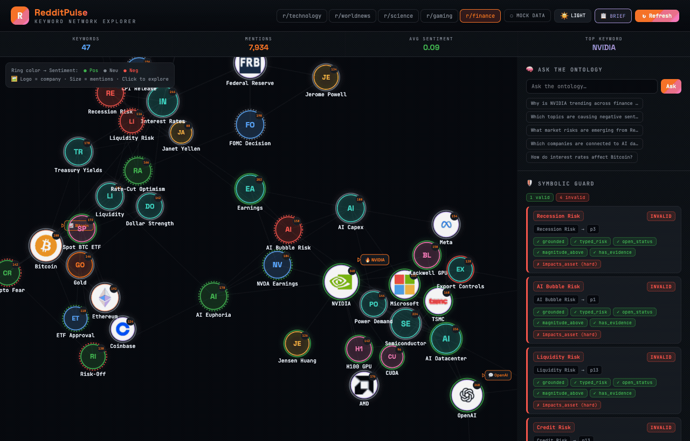
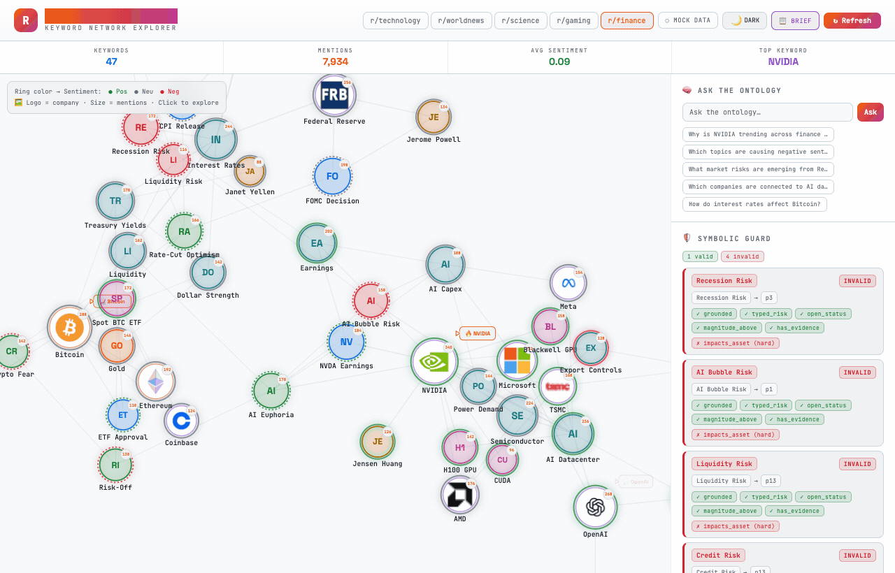

# RedditPulse

**Real-time Reddit keyword network visualizer** — an interactive force-directed graph that maps trending topics, sentiment flows, and community dynamics across subreddits.



<details>
<summary>Light Mode</summary>



</details>

## Features

**Interactive Network Graph**
- D3.js force-directed graph with physics simulation (collision, charge, link forces)
- Drag, zoom, pan with smooth transitions
- Hover to highlight connected nodes and edges
- Click nodes to inspect detailed trend data
- Speech bubble animations on top trending keywords

**Multi-Chart Dashboard**
- Weekly trend line chart per keyword
- Sentiment distribution donut chart
- Top keywords horizontal bar chart
- Drama Detector panel for controversy spikes

**Theming**
- Dark / Light mode toggle with smooth CSS transitions
- Full color palette swap across all components (graph, charts, UI)

**Data Sources**
- Mock data engine with 4 subreddit presets (technology, worldnews, science, gaming)
- Claude API integration ready for live Reddit analysis

## Tech Stack


## Architecture

```
Single-file React app (redditpulse.jsx)
├── ForceGraph     — D3 force simulation + SVG rendering
│   ├── Node rendering (logo / colored circle)
│   ├── Edge rendering with hover highlighting
│   ├── Speech bubbles with puffing animation
│   └── Zoom / drag / click interactions
├── TrendChart     — Chart.js line chart
├── SentDonut      — Chart.js doughnut chart
├── TopBar         — Chart.js horizontal bar chart
└── App            — Layout, state, theme management
```

## Quick Start

```bash
git clone https://github.com/somi/reddit-network-viz.git
cd reddit-network-viz
npm install
npm run dev
```

Open http://localhost:5173

## License

MIT
