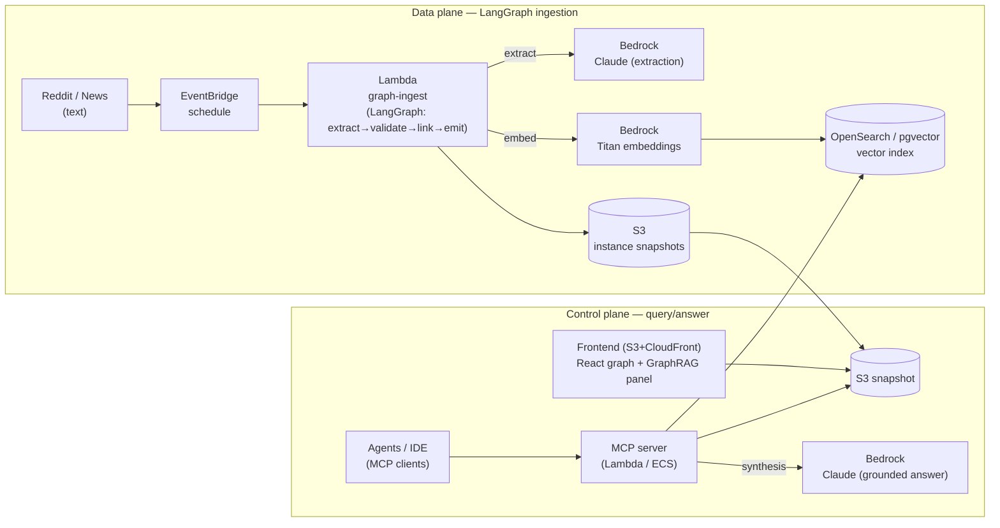

# AWS Architecture — RedditPulse Ontology GraphRAG

How the pieces deploy on AWS. The deterministic engine runs anywhere (incl. the
static frontend); the LLM/ingestion paths use managed AWS services.

## Component → AWS service

| Component | AWS | Notes |
|---|---|---|
| Ingestion pipeline | **Lambda** (`services/graph-ingest`) | LangGraph; EventBridge-triggered |
| LLM extraction + answer synthesis | **Bedrock** (Claude) | `BedrockLLM` adapter (same interface as `ClaudeLLM`) |
| Embeddings | **Bedrock Titan** | backs the `EmbeddingProvider` interface |
| Vector store | **OpenSearch Serverless** or **Aurora pgvector** | swaps in behind `VectorIndex` |
| Instance snapshots | **S3** | frontend reads directly (serverless) |
| MCP server | **Lambda** (HTTP) or **ECS Fargate** | exposes ontology tools to agents |
| Frontend | **S3 + CloudFront** | static React app |

## Swap points (already abstracted in code)

- `src/ontology/llm/provider.js` → `BedrockLLM` (documented adapter)
- `src/ontology/embeddings/provider.js` → Bedrock Titan embedder
- `src/ontology/vector/vectorIndex.js` → OpenSearch/pgvector client
- `services/graph-ingest/llm.py` → already Bedrock-first

Because every external dependency sits behind an interface, "PoC on mock data"
and "production on AWS" are the *same architecture* with different adapters.

## "AWS 꼭 써야 하나요?" — 아니요 (초보자용)

**포트폴리오엔 실제 배포가 *필수가 아님*.** 이 문서(설계도) + 코드의 어댑터만으로 "AWS로 확장 가능하게 설계했다"는 역량은 증명됨. 면접에선 *"deterministic으로 검증했고, Bedrock/Lambda 어댑터를 열어뒀습니다"* 라고 말하면 충분.

각 AWS 서비스 한 줄 요약:

- **Bedrock** = AWS가 빌려주는 LLM/임베딩 (Claude를 AWS 계정으로 호출). 우리 `ClaudeLLM` → `BedrockLLM` 한 줄 교체.
- **Lambda** = 서버 없이 함수만 올려서, 이벤트 오면 자동 실행 (우리 인제스트 파이프라인).
- **S3** = 인터넷 파일 저장소 (인스턴스 스냅샷 JSON 저장 → 프론트가 읽음).
- **OpenSearch / pgvector** = 벡터 저장·검색 DB (지금은 인메모리 `VectorIndex`).

**LLM을 라이브로 보여주고 싶으면 AWS 없이도 됨:** `ANTHROPIC_API_KEY` 하나만 있으면 `ClaudeLLM`로 답변 합성이 진짜로 돌아감. AWS는 "나중에 프로덕션으로 키운다"는 그림일 뿐.

## Cost/ops note

The deterministic path (no Bedrock) is free and offline — good for demos and CI.
Bedrock is only invoked on the LLM synthesis/extraction paths, so spend scales
with real ingestion/answering, not with browsing the graph.
