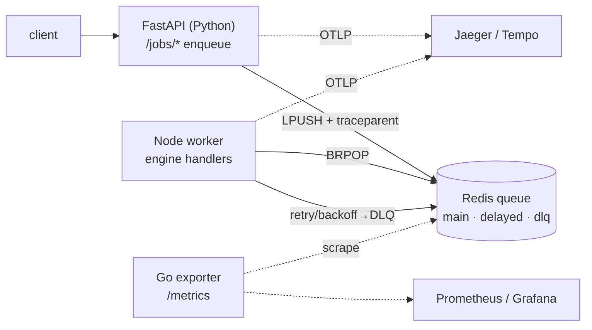

# platform/ — polyglot GraphRAG job platform (SRE layer)

Fills the bottleneck-review gaps (no observability, no queue/retry). A **polyglot**
pipeline with **distributed tracing**, a **resilient queue**, and a **GitOps**
deploy path. The Node worker reuses the *same* JS ontology engine — the platform
layer never reimplements logic.



## Run (docker-compose)

```bash
docker compose -f platform/docker-compose.yml up --build
# API     :8000   Jaeger UI :16686   metrics :9100/metrics

# enqueue jobs (job types: ingest|embedding|graph_write|eval|answer)
curl -XPOST localhost:8000/jobs/eval -d '{"payload":{}}' -H 'content-type: application/json'
curl -XPOST localhost:8000/jobs/answer -d '{"payload":{"question":"Why is NVIDIA trending?"}}' -H 'content-type: application/json'
curl localhost:8000/queue/depth
```

## Resilience (queue.js)
- **retry + exponential backoff** — failed jobs re-scheduled via a delayed ZSET (500ms·1s·2s…)
- **dead-letter queue** — exhausted jobs (> maxRetries) parked in `q:graphrag:dlq`
- **idempotency key** — completed keys deduped so re-submits are no-ops
- **reprocess CLI** — `node platform/worker/reprocess.js --drain` re-enqueues the DLQ

## Distributed tracing
FastAPI injects a W3C `traceparent` into the job; the worker `propagation.extract`s
it and continues the span → **one trace spans API → queue → worker** in Jaeger.
"Which job failed and why" is answerable from the trace + structured error logs.

## Failure scenarios (intentional, to debug)

1. **Secret/env missing** — unset `REDIS_URL` on the worker → `/readyz` 503, worker
   can't `BRPOP`; fix = inject the secret/env. (dev↔prod env-diff class of bug.)
2. **Job failure → retry → DLQ** — enqueue with `{"payload":{"fail":true}}` →
   3 backoff retries (visible as 4 attempts in the trace) → lands in DLQ →
   `reprocess.js --drain` to replay after a fix.
3. **Endpoint diff** — `OTEL_EXPORTER_OTLP_ENDPOINT` correct in dev but wrong in
   prod values → traces vanish in prod only; fix = align Helm `values-prod.yaml`.

## Roadmap (this layer)
- **P1 (done):** FastAPI + Redis queue (retry/backoff/DLQ/idempotency) + Node worker + OTel trace propagation + Go exporter + compose.
- **P2:** Helm chart + `values-{dev,stage,prod}.yaml` + ArgoCD `Application` (GitOps).
- **P3:** Grafana/Tempo/Loki dashboards; capture the 3 failure scenarios with screenshots.
