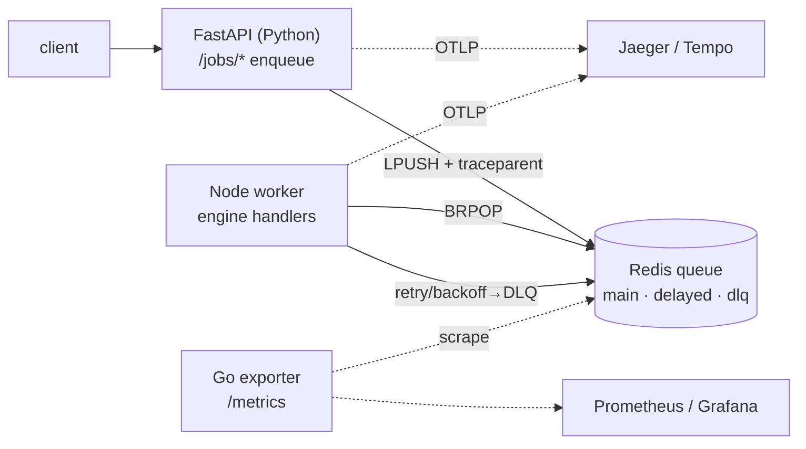

# platform/ — polyglot GraphRAG job platform (SRE layer)

Fills the bottleneck-review gaps (no observability, no queue/retry). A **polyglot**
pipeline with **distributed tracing**, a **resilient queue**, and a **GitOps**
deploy path. The Node worker reuses the *same* JS ontology engine — the platform
layer never reimplements logic.



## Run (docker-compose)

```bash
docker compose -f platform/docker-compose.yml up --build
# API     :8000   Jaeger UI :16686   metrics :9100/metrics

# enqueue jobs (job types: ingest|embedding|graph_write|eval|answer)
curl -XPOST localhost:8000/jobs/eval -d '{"payload":{}}' -H 'content-type: application/json'
curl -XPOST localhost:8000/jobs/answer -d '{"payload":{"question":"Why is NVIDIA trending?"}}' -H 'content-type: application/json'
curl localhost:8000/queue/depth
```

## Resilience (queue.js)
- **retry + exponential backoff** — failed jobs re-scheduled via a delayed ZSET (500ms·1s·2s…)
- **dead-letter queue** — exhausted jobs (> maxRetries) parked in `q:graphrag:dlq`
- **idempotency key** — completed keys deduped so re-submits are no-ops
- **reprocess CLI** — `node platform/worker/reprocess.js --drain` re-enqueues the DLQ

## Observability (traces · logs · metrics)
The compose stack ships a full Grafana observability suite, pre-provisioned:

- **Tempo** — distributed traces (OTLP). FastAPI injects a W3C `traceparent` into
  each job; the worker extracts it and continues the span, so **one trace spans
  API → queue → worker**.
- **Loki + Promtail** — the worker emits structured JSON logs (`level`, `job`,
  `id`, `error`); Promtail ships them to Loki, queryable in Grafana.
- **Prometheus** — scrapes the Go exporter's queue-depth / DLQ gauges.
- **Grafana** (`:3000`) — datasources wired with Tempo→Loki correlation; a
  "GraphRAG Platform" dashboard shows queue depth, DLQ, Redis health and worker
  error logs.

### Debugging "which job failed and why"
1. Grafana → dashboard: DLQ panel turns red → something is dead-lettering.
2. Worker-error-logs panel → find the failing `job.id` and error message.
3. Tempo → search the trace by id → see the API enqueue span and each retry
   attempt with its exception, end to end.
4. Fix, then `node platform/worker/reprocess.js --drain` to replay the DLQ.

## Failure scenarios (intentional, to debug)

1. **Secret/env missing** — unset `REDIS_URL` on the worker → `/readyz` 503, worker
   can't `BRPOP`; fix = inject the secret/env. (dev↔prod env-diff class of bug.)
2. **Job failure → retry → DLQ** — enqueue with `{"payload":{"fail":true}}` →
   3 backoff retries (visible as 4 attempts in the trace) → lands in DLQ →
   `reprocess.js --drain` to replay after a fix.
3. **Endpoint diff** — `OTEL_EXPORTER_OTLP_ENDPOINT` correct in dev but wrong in
   prod values → traces vanish in prod only; fix = align Helm `values-prod.yaml`.

## What's included
- FastAPI gateway + Redis queue (retry, exponential backoff, dead-letter, idempotency) + Node worker reusing the engine, with OTel trace propagation and a reprocess CLI.
- Go metrics exporter (queue-depth / DLQ gauges) and a docker-compose stack.
- Kubernetes deploy: Helm chart with `values-{dev,stage,prod}.yaml` and ArgoCD `Application`s (GitOps).
- Full observability: Grafana + Tempo + Loki + Prometheus, pre-provisioned datasources and a dashboard, with trace→logs correlation for failure triage.
